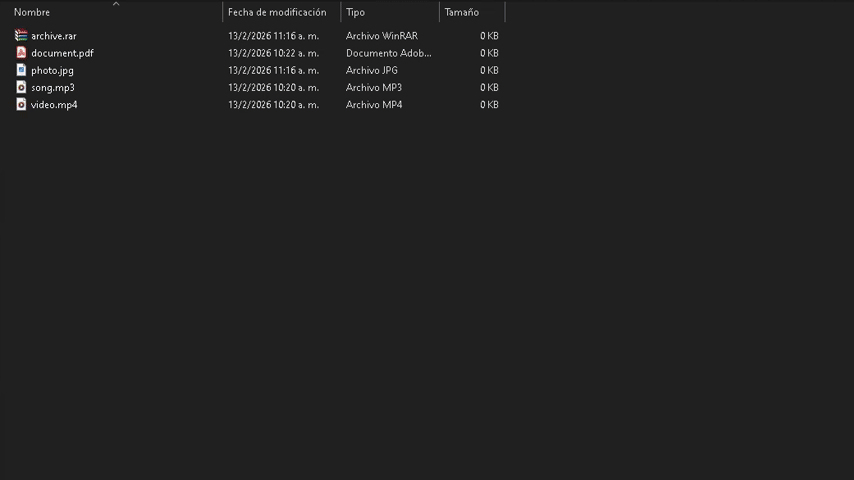

<br>

# Auto Organize CLI

Read this in: **English** | [Spanish](README.es.md)

<br>

A command-line tool (CLI) to **automatically organize files** in any directory on your system.

<br>

## What problem does it solve?

When working with folders that accumulate files (Downloads, Desktop, projects, etc.), things usually get messy:

* Files mixed by type.
* Time wasted manually sorting files.
* Risk of moving or deleting the wrong files.

<br>

> **Auto Organize CLI** automates and fixes this process.

<br>

## Key Features

* Automatic file organization by type (based on file extensions).
* Simulation mode (`--preview`) to preview changes.
* Type filters (`--only`, `--exclude`).
* **Only moves files — never deletes them.**
* Tested on **Windows** and **Linux** (**macOS** compatibility is expected due to **Node.js** cross-platform support).


<br>

## Installation

Requires **Node.js >= 16**

> [Download Node here](https://nodejs.org/en/download)

### Option 1: Without installation (For one-time use)
```bash
npx auto-organize
```

### Option 2: Global Installation (For regular use)
```bash
npm install -g auto-organize
```

<br>

## Basic Usage

Navigate to any directory on your system. For example:

```bash
cd /Users/Downloads
```

Then run:

```bash
auto-organize || npx auto-organize
```

Depending on the files present, it will create folders such as:

```txt
Images/
Documents/
Audio/
Video/
Archives/
```

And move files into their corresponding folders.

```txt
photo.jpg -> Images/

document.pdf -> Documents/

song.mp3 -> Audio/

video.mp4 -> Video/

archive.rar -> Archives/
```
<br>

> **Example**


<br>

## Simulation Mode (preview)

Preview the organization before applying real changes:

```bash
auto-organize --preview || auto-organize -p
```

Example output:

```txt
Images/
    photo.jpg

Documents/
    contract.pdf 

Audio/    
    song.mp3
```

<br>

> **Example** 



## Available Flags

### `--only <type>`

Organize **only** a specific file type.

```bash
auto-organize --only images
```

---

### `--exclude <type>`

Exclude a specific file type from organization.

```bash
auto-organize --exclude archives
```

---

### `--help`

Display the help guide and available types.

```bash
auto-organize --help || auto-organize -h
```

<br>

## Supported Types

* images
* documents
* spreadsheets
* presentations
* archives
* audio
* video
* code

<br>

## Common Use Cases

* Organizing the Downloads folder
* Quick Desktop cleanup
* Automatically classifying project files (e.g. a `/public` directory)

<br>

## Contributing

Contributions are welcome:

1. Fork the project.
2. Create a feature branch: `git checkout -b feature/{your-feature}`
3. Commit your changes: `git commit -m 'Add your feature'`
4. Push the branch: `git push origin feature/{your-feature}`
5. Open a pull request.

<br>

## License

* MIT

<br>

## Author

* LinkedIn: [Christian Mathías Rincón](https://www.linkedin.com/in/christian-math%C3%ADas-rinc%C3%B3n-037a90297/)

* GitHub: [@ChristianRincon](https://github.com/ChristianRincon)
